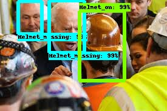

# Application of Artificial Intelligence in Construction Safety

### 1. Installations
Python 3.7
Tensorflow 1.15
LabelImg

### 2. Project Motivation
There are endless applications of A.I and so many possibilities, My thought process was to apply A.I in Costruction in a way that could help in improving the safety of construction workers. This model can add as a safeguard to ensuring the safety of workers in the feild. 

### 3. How it works?
I colllected about 2K images from Google and labelled these images using 'LabelImg'. labelImg is a tool in python which has a very simple interface to label our classes, In this case 'Helmet_on' and 'Helmet_missing'. These images are then converted to a tensorfloe record for training. We are using Tensorflow Object detection 0.1 API here. 

Since I cannot train a model from scratch with limited images, I will use Faster-r-cnn-resnet pre-trained model as my base and modify it to detect classes for this specific use case.

The model is trained untill loss < 0.05 

### 4. Results

